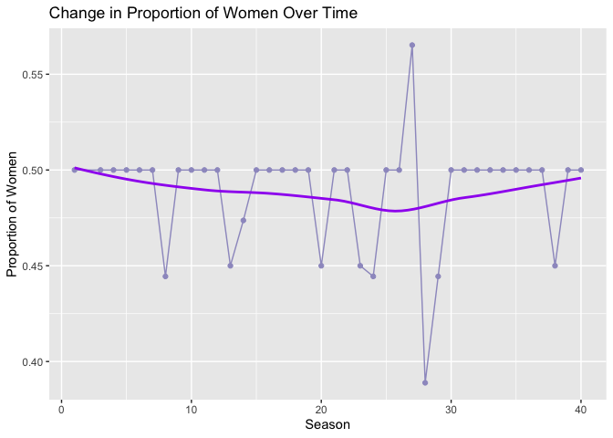
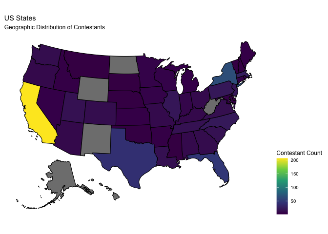

EDA
================

``` r
survivor_data_final = read.csv("data/survivor_data_final.csv")
```

### Summary

``` r
survivor_data_final %>% 
  select(gender, poc, personality_type_binary, age_during_show, days_survived) %>% 
  tbl_summary(type = list(gender ~ "categorical", 
                          poc ~ "categorical", 
                          personality_type_binary ~ "categorical", 
                          age_during_show ~ "continuous", 
                          days_survived ~ "continuous"), 
              statistic = list(all_continuous() ~ "{mean} ({sd})"), 
              digits = all_continuous() ~ 1,
              label = list(c(gender) ~ "Gender",
                           c(poc) ~ "Race Identifier",
                           c(personality_type_binary) ~ "Personality Type",
                           c(age_during_show) ~ "Age During Show (Years)",
                           c(days_survived) ~ "Survival Time on Show (Days)")) %>% 
  bold_labels() %>%
  as_gt() # %>%             # convert to gt table
```

<div id="ycrlgqdolm" style="padding-left:0px;padding-right:0px;padding-top:10px;padding-bottom:10px;overflow-x:auto;overflow-y:auto;width:auto;height:auto;">
<style>html {
  font-family: -apple-system, BlinkMacSystemFont, 'Segoe UI', Roboto, Oxygen, Ubuntu, Cantarell, 'Helvetica Neue', 'Fira Sans', 'Droid Sans', Arial, sans-serif;
}

#ycrlgqdolm .gt_table {
  display: table;
  border-collapse: collapse;
  margin-left: auto;
  margin-right: auto;
  color: #333333;
  font-size: 16px;
  font-weight: normal;
  font-style: normal;
  background-color: #FFFFFF;
  width: auto;
  border-top-style: solid;
  border-top-width: 2px;
  border-top-color: #A8A8A8;
  border-right-style: none;
  border-right-width: 2px;
  border-right-color: #D3D3D3;
  border-bottom-style: solid;
  border-bottom-width: 2px;
  border-bottom-color: #A8A8A8;
  border-left-style: none;
  border-left-width: 2px;
  border-left-color: #D3D3D3;
}

#ycrlgqdolm .gt_heading {
  background-color: #FFFFFF;
  text-align: center;
  border-bottom-color: #FFFFFF;
  border-left-style: none;
  border-left-width: 1px;
  border-left-color: #D3D3D3;
  border-right-style: none;
  border-right-width: 1px;
  border-right-color: #D3D3D3;
}

#ycrlgqdolm .gt_caption {
  padding-top: 4px;
  padding-bottom: 4px;
}

#ycrlgqdolm .gt_title {
  color: #333333;
  font-size: 125%;
  font-weight: initial;
  padding-top: 4px;
  padding-bottom: 4px;
  padding-left: 5px;
  padding-right: 5px;
  border-bottom-color: #FFFFFF;
  border-bottom-width: 0;
}

#ycrlgqdolm .gt_subtitle {
  color: #333333;
  font-size: 85%;
  font-weight: initial;
  padding-top: 0;
  padding-bottom: 6px;
  padding-left: 5px;
  padding-right: 5px;
  border-top-color: #FFFFFF;
  border-top-width: 0;
}

#ycrlgqdolm .gt_bottom_border {
  border-bottom-style: solid;
  border-bottom-width: 2px;
  border-bottom-color: #D3D3D3;
}

#ycrlgqdolm .gt_col_headings {
  border-top-style: solid;
  border-top-width: 2px;
  border-top-color: #D3D3D3;
  border-bottom-style: solid;
  border-bottom-width: 2px;
  border-bottom-color: #D3D3D3;
  border-left-style: none;
  border-left-width: 1px;
  border-left-color: #D3D3D3;
  border-right-style: none;
  border-right-width: 1px;
  border-right-color: #D3D3D3;
}

#ycrlgqdolm .gt_col_heading {
  color: #333333;
  background-color: #FFFFFF;
  font-size: 100%;
  font-weight: normal;
  text-transform: inherit;
  border-left-style: none;
  border-left-width: 1px;
  border-left-color: #D3D3D3;
  border-right-style: none;
  border-right-width: 1px;
  border-right-color: #D3D3D3;
  vertical-align: bottom;
  padding-top: 5px;
  padding-bottom: 6px;
  padding-left: 5px;
  padding-right: 5px;
  overflow-x: hidden;
}

#ycrlgqdolm .gt_column_spanner_outer {
  color: #333333;
  background-color: #FFFFFF;
  font-size: 100%;
  font-weight: normal;
  text-transform: inherit;
  padding-top: 0;
  padding-bottom: 0;
  padding-left: 4px;
  padding-right: 4px;
}

#ycrlgqdolm .gt_column_spanner_outer:first-child {
  padding-left: 0;
}

#ycrlgqdolm .gt_column_spanner_outer:last-child {
  padding-right: 0;
}

#ycrlgqdolm .gt_column_spanner {
  border-bottom-style: solid;
  border-bottom-width: 2px;
  border-bottom-color: #D3D3D3;
  vertical-align: bottom;
  padding-top: 5px;
  padding-bottom: 5px;
  overflow-x: hidden;
  display: inline-block;
  width: 100%;
}

#ycrlgqdolm .gt_group_heading {
  padding-top: 8px;
  padding-bottom: 8px;
  padding-left: 5px;
  padding-right: 5px;
  color: #333333;
  background-color: #FFFFFF;
  font-size: 100%;
  font-weight: initial;
  text-transform: inherit;
  border-top-style: solid;
  border-top-width: 2px;
  border-top-color: #D3D3D3;
  border-bottom-style: solid;
  border-bottom-width: 2px;
  border-bottom-color: #D3D3D3;
  border-left-style: none;
  border-left-width: 1px;
  border-left-color: #D3D3D3;
  border-right-style: none;
  border-right-width: 1px;
  border-right-color: #D3D3D3;
  vertical-align: middle;
  text-align: left;
}

#ycrlgqdolm .gt_empty_group_heading {
  padding: 0.5px;
  color: #333333;
  background-color: #FFFFFF;
  font-size: 100%;
  font-weight: initial;
  border-top-style: solid;
  border-top-width: 2px;
  border-top-color: #D3D3D3;
  border-bottom-style: solid;
  border-bottom-width: 2px;
  border-bottom-color: #D3D3D3;
  vertical-align: middle;
}

#ycrlgqdolm .gt_from_md > :first-child {
  margin-top: 0;
}

#ycrlgqdolm .gt_from_md > :last-child {
  margin-bottom: 0;
}

#ycrlgqdolm .gt_row {
  padding-top: 8px;
  padding-bottom: 8px;
  padding-left: 5px;
  padding-right: 5px;
  margin: 10px;
  border-top-style: solid;
  border-top-width: 1px;
  border-top-color: #D3D3D3;
  border-left-style: none;
  border-left-width: 1px;
  border-left-color: #D3D3D3;
  border-right-style: none;
  border-right-width: 1px;
  border-right-color: #D3D3D3;
  vertical-align: middle;
  overflow-x: hidden;
}

#ycrlgqdolm .gt_stub {
  color: #333333;
  background-color: #FFFFFF;
  font-size: 100%;
  font-weight: initial;
  text-transform: inherit;
  border-right-style: solid;
  border-right-width: 2px;
  border-right-color: #D3D3D3;
  padding-left: 5px;
  padding-right: 5px;
}

#ycrlgqdolm .gt_stub_row_group {
  color: #333333;
  background-color: #FFFFFF;
  font-size: 100%;
  font-weight: initial;
  text-transform: inherit;
  border-right-style: solid;
  border-right-width: 2px;
  border-right-color: #D3D3D3;
  padding-left: 5px;
  padding-right: 5px;
  vertical-align: top;
}

#ycrlgqdolm .gt_row_group_first td {
  border-top-width: 2px;
}

#ycrlgqdolm .gt_summary_row {
  color: #333333;
  background-color: #FFFFFF;
  text-transform: inherit;
  padding-top: 8px;
  padding-bottom: 8px;
  padding-left: 5px;
  padding-right: 5px;
}

#ycrlgqdolm .gt_first_summary_row {
  border-top-style: solid;
  border-top-color: #D3D3D3;
}

#ycrlgqdolm .gt_first_summary_row.thick {
  border-top-width: 2px;
}

#ycrlgqdolm .gt_last_summary_row {
  padding-top: 8px;
  padding-bottom: 8px;
  padding-left: 5px;
  padding-right: 5px;
  border-bottom-style: solid;
  border-bottom-width: 2px;
  border-bottom-color: #D3D3D3;
}

#ycrlgqdolm .gt_grand_summary_row {
  color: #333333;
  background-color: #FFFFFF;
  text-transform: inherit;
  padding-top: 8px;
  padding-bottom: 8px;
  padding-left: 5px;
  padding-right: 5px;
}

#ycrlgqdolm .gt_first_grand_summary_row {
  padding-top: 8px;
  padding-bottom: 8px;
  padding-left: 5px;
  padding-right: 5px;
  border-top-style: double;
  border-top-width: 6px;
  border-top-color: #D3D3D3;
}

#ycrlgqdolm .gt_striped {
  background-color: rgba(128, 128, 128, 0.05);
}

#ycrlgqdolm .gt_table_body {
  border-top-style: solid;
  border-top-width: 2px;
  border-top-color: #D3D3D3;
  border-bottom-style: solid;
  border-bottom-width: 2px;
  border-bottom-color: #D3D3D3;
}

#ycrlgqdolm .gt_footnotes {
  color: #333333;
  background-color: #FFFFFF;
  border-bottom-style: none;
  border-bottom-width: 2px;
  border-bottom-color: #D3D3D3;
  border-left-style: none;
  border-left-width: 2px;
  border-left-color: #D3D3D3;
  border-right-style: none;
  border-right-width: 2px;
  border-right-color: #D3D3D3;
}

#ycrlgqdolm .gt_footnote {
  margin: 0px;
  font-size: 90%;
  padding-left: 4px;
  padding-right: 4px;
  padding-left: 5px;
  padding-right: 5px;
}

#ycrlgqdolm .gt_sourcenotes {
  color: #333333;
  background-color: #FFFFFF;
  border-bottom-style: none;
  border-bottom-width: 2px;
  border-bottom-color: #D3D3D3;
  border-left-style: none;
  border-left-width: 2px;
  border-left-color: #D3D3D3;
  border-right-style: none;
  border-right-width: 2px;
  border-right-color: #D3D3D3;
}

#ycrlgqdolm .gt_sourcenote {
  font-size: 90%;
  padding-top: 4px;
  padding-bottom: 4px;
  padding-left: 5px;
  padding-right: 5px;
}

#ycrlgqdolm .gt_left {
  text-align: left;
}

#ycrlgqdolm .gt_center {
  text-align: center;
}

#ycrlgqdolm .gt_right {
  text-align: right;
  font-variant-numeric: tabular-nums;
}

#ycrlgqdolm .gt_font_normal {
  font-weight: normal;
}

#ycrlgqdolm .gt_font_bold {
  font-weight: bold;
}

#ycrlgqdolm .gt_font_italic {
  font-style: italic;
}

#ycrlgqdolm .gt_super {
  font-size: 65%;
}

#ycrlgqdolm .gt_footnote_marks {
  font-style: italic;
  font-weight: normal;
  font-size: 75%;
  vertical-align: 0.4em;
}

#ycrlgqdolm .gt_asterisk {
  font-size: 100%;
  vertical-align: 0;
}

#ycrlgqdolm .gt_indent_1 {
  text-indent: 5px;
}

#ycrlgqdolm .gt_indent_2 {
  text-indent: 10px;
}

#ycrlgqdolm .gt_indent_3 {
  text-indent: 15px;
}

#ycrlgqdolm .gt_indent_4 {
  text-indent: 20px;
}

#ycrlgqdolm .gt_indent_5 {
  text-indent: 25px;
}
</style>
<table class="gt_table">
  
  <thead class="gt_col_headings">
    <tr>
      <th class="gt_col_heading gt_columns_bottom_border gt_left" rowspan="1" colspan="1" scope="col" id="&lt;strong&gt;Characteristic&lt;/strong&gt;"><strong>Characteristic</strong></th>
      <th class="gt_col_heading gt_columns_bottom_border gt_center" rowspan="1" colspan="1" scope="col" id="&lt;strong&gt;N = 728&lt;/strong&gt;&lt;sup class=&quot;gt_footnote_marks&quot;&gt;1&lt;/sup&gt;"><strong>N = 728</strong><sup class="gt_footnote_marks">1</sup></th>
    </tr>
  </thead>
  <tbody class="gt_table_body">
    <tr><td headers="label" class="gt_row gt_left" style="font-weight: bold;">Gender</td>
<td headers="stat_0" class="gt_row gt_center"></td></tr>
    <tr><td headers="label" class="gt_row gt_left">    Female</td>
<td headers="stat_0" class="gt_row gt_center">356 (49%)</td></tr>
    <tr><td headers="label" class="gt_row gt_left">    Male</td>
<td headers="stat_0" class="gt_row gt_center">368 (51%)</td></tr>
    <tr><td headers="label" class="gt_row gt_left">    Unknown</td>
<td headers="stat_0" class="gt_row gt_center">4</td></tr>
    <tr><td headers="label" class="gt_row gt_left" style="font-weight: bold;">Race Identifier</td>
<td headers="stat_0" class="gt_row gt_center"></td></tr>
    <tr><td headers="label" class="gt_row gt_left">    POC</td>
<td headers="stat_0" class="gt_row gt_center">199 (27%)</td></tr>
    <tr><td headers="label" class="gt_row gt_left">    White</td>
<td headers="stat_0" class="gt_row gt_center">525 (73%)</td></tr>
    <tr><td headers="label" class="gt_row gt_left">    Unknown</td>
<td headers="stat_0" class="gt_row gt_center">4</td></tr>
    <tr><td headers="label" class="gt_row gt_left" style="font-weight: bold;">Personality Type</td>
<td headers="stat_0" class="gt_row gt_center"></td></tr>
    <tr><td headers="label" class="gt_row gt_left">    Extrovert</td>
<td headers="stat_0" class="gt_row gt_center">401 (56%)</td></tr>
    <tr><td headers="label" class="gt_row gt_left">    Introvert</td>
<td headers="stat_0" class="gt_row gt_center">320 (44%)</td></tr>
    <tr><td headers="label" class="gt_row gt_left">    Unknown</td>
<td headers="stat_0" class="gt_row gt_center">7</td></tr>
    <tr><td headers="label" class="gt_row gt_left" style="font-weight: bold;">Age During Show (Years)</td>
<td headers="stat_0" class="gt_row gt_center">33.4 (10.1)</td></tr>
    <tr><td headers="label" class="gt_row gt_left" style="font-weight: bold;">Survival Time on Show (Days)</td>
<td headers="stat_0" class="gt_row gt_center">23.9 (12.1)</td></tr>
  </tbody>
  
  <tfoot class="gt_footnotes">
    <tr>
      <td class="gt_footnote" colspan="2"><sup class="gt_footnote_marks">1</sup> n (%); Mean (SD)</td>
    </tr>
  </tfoot>
</table>
</div>

``` r
  # gt::gtsave(             # save table as image
  #  filename = "table_0_new.png"
  #)
```

Note: N = 728 refers to the total count of records (i.e. contestant
occurrences) in `survivor_data_final`; distinct persons may be listed in
multiple records, across seasons and/or within seasons.

``` r
## Personality type
survivor_data_final %>% 
  group_by(personality_type_binary) %>% 
  summarize(n_personality_dist = n_distinct(full_name),
            n_personality_occ = n(),
            mean_days_survived = mean(days_survived)) %>% 
    na.omit()  %>%
  knitr::kable(digits = 1, col.names = c("Personality Type", "Distinct Persons", "Contestant Occurrences", "Mean Days Survived"))
```

| Personality Type | Distinct Persons | Contestant Occurrences | Mean Days Survived |
|:-----------------|-----------------:|-----------------------:|-------------------:|
| Extrovert        |              309 |                    401 |               24.0 |
| Introvert        |              271 |                    320 |               23.6 |

``` r
## POC Status
survivor_data_final %>% 
  group_by(poc) %>% 
  summarize(n_poc_dist = n_distinct(full_name),
            n_poc_occ = n(),
            mean_days_survived = mean(days_survived, na.rm = TRUE)) %>% 
    na.omit()  %>%
  knitr::kable(digits = 1, col.names = c("POC Status", "Distinct Persons", "Contestant Occurrences", "Mean Days Survived"))
```

| POC Status | Distinct Persons | Contestant Occurrences | Mean Days Survived |
|:-----------|-----------------:|-----------------------:|-------------------:|
| POC        |              164 |                    199 |               22.6 |
| White      |              418 |                    525 |               24.3 |

``` r
## Gender
survivor_data_final %>% 
  group_by(gender) %>% 
  summarize(n_gender_dist = n_distinct(full_name),
            n_gender_occ = n(),
            mean_days_survived = mean(days_survived, na.rm = TRUE)) %>%
    na.omit()  %>%
  knitr::kable(digits = 1, col.names = c("Gender", "Distinct Persons", "Contestant Occurrences", "Mean Days Survived"))
```

| Gender | Distinct Persons | Contestant Occurrences | Mean Days Survived |
|:-------|-----------------:|-----------------------:|-------------------:|
| Female |              292 |                    356 |               23.1 |
| Male   |              290 |                    368 |               24.5 |

Note: We report both distinct person counts and contestant occurrences
by personality type, POC status, and gender.

### POC and Gender Representation Across Seasons

``` r
fill_color = brewer.pal(9,"Reds")[4]
survivor_poc_over_time = survivor_data_final %>% 
  group_by(version_season, poc) %>%
  summarize(count = n_distinct(full_name)) %>%
  mutate(freq = count / sum(count)) %>%
  filter(poc == "POC") %>%
  separate(col = version_season, into = c('NA', 'season'), sep = 2) %>%
  dplyr::select(-"NA") %>%
  mutate(season = as.numeric(season))

ggplot(data = survivor_poc_over_time, aes(x = season, y = freq, group = 1)) +
  geom_line(color = fill_color) +
  geom_point(color = fill_color) +
  geom_smooth(se = FALSE, color = "seashell") + 
  ggtitle("Change in Proportion of POC Over Time ") +
  xlab("Season") + ylab("Proportion of POC")
```

<!-- -->

Note: Distinct person counts by POC status.

``` r
fill_color = brewer.pal(9,"Purples")[5]
survivor_gender_over_time = survivor_data_final %>% 
  group_by(version_season, gender) %>%
  summarize(count = n_distinct(full_name)) %>%
  mutate(freq = count / sum(count)) %>%
  filter(gender == "Female") %>%
  separate(col = version_season, into = c('NA', 'season'), sep = 2) %>%
  dplyr::select(-"NA") %>%
  mutate(season = as.numeric(season))

ggplot(data = survivor_gender_over_time, aes(x = season, y = freq, group = 1)) +
  geom_line(color = fill_color) +
  geom_point(color = fill_color) +
  geom_smooth(se = FALSE, color = "purple") + 
  ggtitle("Change in Proportion of Women Over Time") +
  xlab("Season") + ylab("Proportion of Women")
```

<!-- -->

Note: Distinct person counts by gender.

### Concentration of Contestants by Age and Geography

``` r
fill_color = brewer.pal(9,"PuBuGn")[5]
ggplot(survivor_data_final, aes(x = age_during_show)) + 
  geom_histogram(aes(y = after_stat(count/sum(count))), bins = 15, fill = fill_color, col = "white") +
  scale_y_continuous(labels = scales::percent) + 
  ggtitle("Distribution of Ages Across Contestant Occurrences") +
  xlab("Age (During Show)") + ylab("Count")
```

<!-- -->

Note: Since contestants can re-appear across seasons at different ages,
we rely on discrete records from `survivor_data_final` (i.e. contestant
occurrences) as the unit of analysis for this plot in order to ensure
comprehensiveness of age data.

``` r
survivor_state = survivor_data_final %>%
  group_by(state) %>%
  summarize(n = n())

plot_usmap(
  data = survivor_state, values = "n", lines = "blue"
) + 
  scale_fill_continuous(type = "viridis", name = "Contestant Count", label = scales::comma
  ) + 
  labs(title = "US States", subtitle = "Geographic Distribution of Contestants") +
  theme(legend.position = "right")
```

<!-- -->

Notes: (i) Seasons 2, 41, 42, and 43 have been removed from the
exploratory analysis due to inconsistent number of days. (ii) Since
contestants can re-appear across seasons with different states of
residence, we similarly rely on discrete records from
`survivor_data_final` (i.e. contestant occurrences) as the unit of
analysis for this plot in order to ensure comprehensiveness of location
data.
