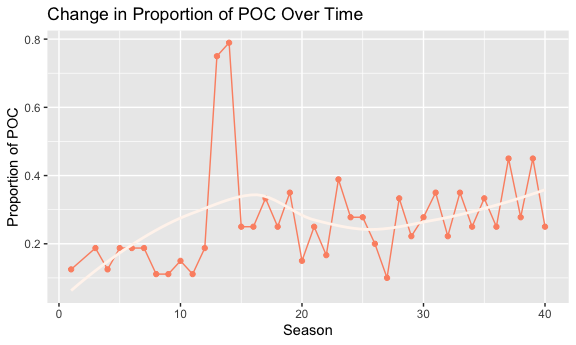
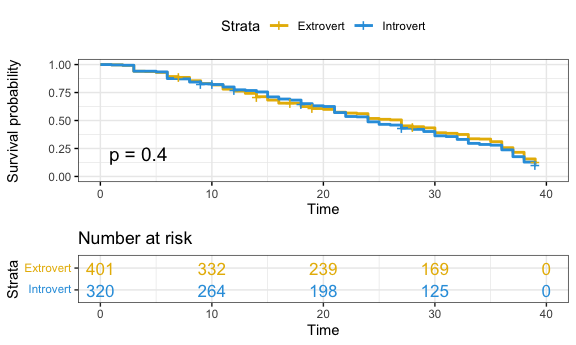
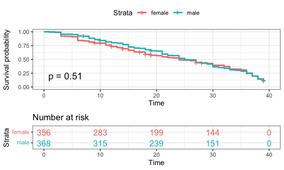
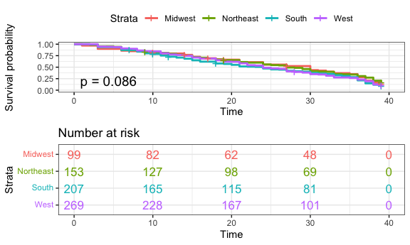

Survivor(al) Analysis: Impacts of Demographics on Game Show Contestant
Survival
================

## Introduction

### Motivation

In this report, we utilize survival analysis to explore the implications
of known race, gender, and personality type to game show survival. In
particular, we focus on the American classic TV series *Survivor*, which
is currently on its 43rd season. In each season of the show, 16 to 18
contestants are divided into tribes and navigate challenges within these
social alliances in order to promote their own survival.[^1] Throughout
each season, contestants are progressively eliminated by vote of their
peers until there is a sole survivor. Given that aspects of identity
heavily influence how people are perceived in a social context, we
hypothesize that contestant outcomes may differ on the measures related
to retention or screen time.

### Related Work

While survival analysis is a statistical methodology typically used in
health fields to understand the time to an event of interest (such as
death, myocardial infarction, or cancer recurrence)[^2], we are able to
utilize the number of days survived on *Survivor* as our main outcome of
interest. Our inspiration for this project came from a small scale paper
studying the effects of demographics in *Masterchef Junior* contestant
survival rates.[^3] This research looked at race and gender to determine
the outcome of percent of season survived, with the additional analysis
to look at the impact of a female judge on these survival rates. While
the TV series *Survivor* and *Masterchef Junior* differ in their
elimination processes, both our studies explore the intricacies of
societal bias and how that plays into game show success.

### Initial Questions

Our initial goal was to investigate the extent to which gender, race,
and personality have led to differences in days survived on *Survivor*.
Based on cultural norms in the U.S., we hypothesized that contestants
who are white, male, or extroverts would have the longest survival time.
In determining a lack of results on these measures, we decided to
integrate geographic comparisons as well for survival time. More
additional questions arose throughout the course of our research. We
determined that another component of entertainment culture was not only
how long the contestants stayed on the show, but how much individualized
screen time they received while there. Thus, we decided to explore the
frequency of confessionals as supplementary analyses. Finally, in more
recent years (in alignment with the Black Lives Matter movement in the
U.S.), *Survivor* has made the effort to encourage more diversity within
their casts. To this end, we also wanted to visually see if contestants
had representation that evolved over the 42 seasons. In this paper, we
consider all these aspects as part of a comprehensive investigation of
demographics on game show survival.

## Data Sources & Cleaning

In order to analyze the show *Survivor*, we used data sources from the
`castaway_details` and `castaways` datasets[^4], as well as others, from
the `survivoR` package.[^5] This fan-made package contains data from all
seasons of *Survivor*. According to the authors of the package, “the
data was sourced from Wikipedia and the Survivor Wiki. Other data, such
as the tribe colours, was manually recorded and entered by myself and
contributors.” As each dataset contained distinct information on the
contestants for each season, it was necessary to use joins to combine
datasets to produce a final dataset to be analyzed. This was performed
using a full join on the contestants’ full names. It should be noted
that contestants can appear in multiple seasons; we rely on contestant
occurrences as the unit of analysis throughout most of our analysis.
Additionally, in order to standardize our results for the survival
analysis and exploratory data analysis, we removed seasons 2, 41, 42,
and 43 as the seasons contained data for a different number of days from
the standard 39 days. As the original data contains information from
several versions around the globe, it was integral to filter and only
analyze data from the U.S. edition. In order to best model our
covariates of interest, we then created a new personality type variable
(extracting whether a person is an introvert or extrovert) and used a
POC indicator variable (provided by the package) instead of individual
races. We also used contestants’ home states to code contestants into a
region based on census regions and divisions of the United States.[^6]
Furthermore, we determined that missing data was not an issue, as it
occurred in low frequency and was not patterned in nature. The final
dataset used in the analysis contains unique information for each
castaway for each season, including the following key variables:

-   `version_season`: version and season number
-   `full_name`: contestant full name
-   `age_during_show` : age, in years
-   `poc` : POC indicator, if known. Else, marked as White.
-   `gender`: 2 levels: Female, Male.
-   `personality_type_binary` : Extracted from the Myer-Briggs
    personality type of the castaway. 2 levels: Extrovert, Introvert.
-   `days_survived`: Number of days survived in the show until
    elimination
-   `region`: region in the U.S. where the contestant is from. We
    created this variable based on the `state` variable available in the
    dataset. 4 levels: West, Midwest, Northeast, South. Indicator
    variables for each of the 4 regions have also been created for
    analyses.

As a supplemental analysis, we also used the `confessionals` data from
the same `survivoR` package to visualize the number of confessionals
each contestant received. This data looked at all seasons as it was
unrelated to the survival analysis and consistency in the datasets was
not necessary. Nevertheless, this data also only looked at the U.S.
edition of the show.

## Exploratory Analysis

We performed exploratory data analysis to visualize the distributions of
our variables of interest, including POC, gender, personality type, age,
and geographic location. In order to best depict the true nature of our
data, we used a combination of tables and plots, depending on which
method we believed to be most effective. In our summary demographic
table, we specifically count contestant occurrences, while noting that
distinct individuals can recur across multiple seasons or episodes
within a season.

**Table 1: Summary Statistics**

*Note: N = 728 refers to the total count of records (i.e. contestant
occurrences) in `survivor_data_final`; distinct persons may be listed in
multiple records, across seasons and/or within seasons.*

Additionally, we used a histogram plot to identify a right-skewed
distribution in ages of contestants.

**Figure 1: Distribution of Age**

*Note: Since contestants can re-appear across seasons at different ages,
we rely on discrete records from `survivor_data_final` (i.e. contestant
occurrences) as the unit of analysis for this plot in order to ensure
comprehensiveness of age data.*

We also included tables showing the mean days survived based on these
demographic measures of interest.

**Table 2: Days Survived by Covariates**  
<table>
<thead>
<tr>
<th style="text-align:left;">
Personality Type
</th>
<th style="text-align:right;">
Distinct Persons
</th>
<th style="text-align:right;">
Contestant Occurrences
</th>
<th style="text-align:right;">
Mean Days Survived
</th>
</tr>
</thead>
<tbody>
<tr>
<td style="text-align:left;">
Extrovert
</td>
<td style="text-align:right;">
309
</td>
<td style="text-align:right;">
401
</td>
<td style="text-align:right;">
24.0
</td>
</tr>
<tr>
<td style="text-align:left;">
Introvert
</td>
<td style="text-align:right;">
271
</td>
<td style="text-align:right;">
320
</td>
<td style="text-align:right;">
23.6
</td>
</tr>
</tbody>
</table>
<table>
<thead>
<tr>
<th style="text-align:left;">
POC Status
</th>
<th style="text-align:right;">
Distinct Persons
</th>
<th style="text-align:right;">
Contestant Occurrences
</th>
<th style="text-align:right;">
Mean Days Survived
</th>
</tr>
</thead>
<tbody>
<tr>
<td style="text-align:left;">
POC
</td>
<td style="text-align:right;">
164
</td>
<td style="text-align:right;">
199
</td>
<td style="text-align:right;">
22.6
</td>
</tr>
<tr>
<td style="text-align:left;">
White
</td>
<td style="text-align:right;">
418
</td>
<td style="text-align:right;">
525
</td>
<td style="text-align:right;">
24.3
</td>
</tr>
</tbody>
</table>
<table>
<thead>
<tr>
<th style="text-align:left;">
Gender
</th>
<th style="text-align:right;">
Distinct Persons
</th>
<th style="text-align:right;">
Contestant Occurrences
</th>
<th style="text-align:right;">
Mean Days Survived
</th>
</tr>
</thead>
<tbody>
<tr>
<td style="text-align:left;">
Female
</td>
<td style="text-align:right;">
292
</td>
<td style="text-align:right;">
356
</td>
<td style="text-align:right;">
23.1
</td>
</tr>
<tr>
<td style="text-align:left;">
Male
</td>
<td style="text-align:right;">
290
</td>
<td style="text-align:right;">
368
</td>
<td style="text-align:right;">
24.5
</td>
</tr>
</tbody>
</table>
<table>
<thead>
<tr>
<th style="text-align:left;">
Region
</th>
<th style="text-align:right;">
Distinct Persons
</th>
<th style="text-align:right;">
Contestant Occurrences
</th>
<th style="text-align:right;">
Mean Days Survived
</th>
</tr>
</thead>
<tbody>
<tr>
<td style="text-align:left;">
Midwest
</td>
<td style="text-align:right;">
84
</td>
<td style="text-align:right;">
99
</td>
<td style="text-align:right;">
24.4
</td>
</tr>
<tr>
<td style="text-align:left;">
Northeast
</td>
<td style="text-align:right;">
122
</td>
<td style="text-align:right;">
153
</td>
<td style="text-align:right;">
25.0
</td>
</tr>
<tr>
<td style="text-align:left;">
South
</td>
<td style="text-align:right;">
178
</td>
<td style="text-align:right;">
207
</td>
<td style="text-align:right;">
22.7
</td>
</tr>
<tr>
<td style="text-align:left;">
West
</td>
<td style="text-align:right;">
218
</td>
<td style="text-align:right;">
269
</td>
<td style="text-align:right;">
23.8
</td>
</tr>
</tbody>
</table>

Next, to visualize the geographic origins of *Survivor* contestants, we
created a map to chart the number of contestants coming from each state.
This map indicates that California was the most popular state of origin
for contestants.

**Figure 2: Map of Geographic Origins**

*Notes:*  
*i) Seasons 2, 41, 42, and 43 have been removed from the exploratory
analysis due to inconsistent number of days.*  
*ii) Since contestants can re-appear across seasons with different
states of residence, we similarly rely on discrete records from
`survivor_data_final` (i.e. contestant occurrences) as the unit of
analysis for this plot in order to ensure comprehensiveness of location
data.*

Additionally, we used a line plot to visualize the change in diversity
(looking at both POC status and gender) to view how the proportion of
POC and women has changed over the show’s many seasons.

**Figure 3:**

*Note: Distinct person counts by POC status.*

According to the trends of the proportion of POC, the initial seasons
had a very low proportion of POC contestants and the overall data shows
an increasing trend in the proportion of POC. It was interesting to note
that some “early” seasons such as seasons 13 and 14 had very high
proportions of POC (over 0.5).

**Figure 4:**

*Note: Distinct person counts by gender.*

The graph for the proportion of women per season shows a relatively
steady trend around 0.5, indicating a generally even distribution of men
and women in the data. There are some seasons with a proportion less
than 0.5, but a majority of seasons had an exact proportion of 0.5.

In addition to the aforementioned exploratory data analysis, we were
curious to see which contestants were receiving the most confessionals.
As a result, we created a Shiny app that allows users to select which
season they would like to view. Users can then examine the number of
confessionals each contestant received, as well as the total number of
confessionals they received over the season, and the mean number of
confessionals per episode they received while on the show.

## Survival Analysis:

### Methodology:

For our statistical analysis, we used survival analysis to understand
the time to elimination for *Survivor* contestants. In this method, we
suppose that there is a true survival time, T, as well as a true
censoring time, C. The survival time represents the time at which the
event of interest occurs: in this dataset, the time (in days) at which
participant is voted out. The censoring time is the time at which the
participant drop out of the game show or survived until the last day of
the show.

We observed the Survival Time T and Censoring Time C. Suppose there is a
random variable Y

$$Y = min(T,C)$$ In other words, if the event occurs before the
censoring such that T $<$ C, then we observed the true survival time T.
If censoring occurs before the event such as T $>$ C, then we observe
the censoring time. The status indicator as,

$$\delta = \begin{cases} 
       1 &  T\leq C \\
       0 & T > C
   \end{cases}$$

Thus, $\delta$ = 1 if we observe the true survival time, and $\delta$ =
0 if we observe the censoring.

We use the Cox-propositional hazard model to evaluate the effect of
several factors on survival time in Survivor. It allows us to examine
how specified factors influence the rate of the event that we are
interested in at a particular point in time. This rate is the hazard
rate. Covariates are age, gender, personality type, and region in this
model. The Cox model is expressed by the hazard function denoted by
h(t). Briefly, the hazard function can be interpreted as the risk of
voted out at time t. It can be estimated as follow:
$$h(t) = h_0(t)\exp(x_1\beta_1 + x_2\beta_2 + x_3\beta_3 + x_4\beta_4 + x_4\beta_5)$$
where,  

-   $t$ represents the survival time
-   $h(t)$ is the hazard function determined by a set of participants’
    covariates $(x_1, x_2, x_3, x_4, x_5)$: $x_1$ is gender, $x_2$ is
    POC, $x_3$ is age during the show, $x_4$ is personality type, and
    $x_5$ is region
-   the coefficients $(\beta1, \beta2, \beta3, \beta4, \beta5)$ measures
    the impact of covariates
-   $h_0(t)\geq 0$ is the baseline hazard function. It is the hazard
    function for an individual if all $(x_1, x_2, x_3, x_4, x_5)$ are
    equal to zero.

## Cox Proportional-Hazards Model

To investigate the number of days survived on *Survivor*, we built a Cox
Proportional-Hazards Model adjusting for the variables of age, gender,
personality type (introvert vs extrovert) and POC (White vs POC). The
Cox Proportional-Hazards model was chosen since it allows us to examine
multiple factors that could be influencing the rate at which contestants
are eliminated. An assumption of the Cox Proportional-Hazards model is
that each covariate has a multiplicative effect in the hazards function
that is constant over time. After fitting the Cox model, we tested the
assumption and none of the covariates in our model are in violation.

# Results

## Kaplan-Meier Curves

To investigate each of the covariates individually, we created
Kaplan-Meier curves to look at survival time with respect to:

**Figure 5: Personality Type** (Introvert vs Extrovert)

**Figure 6: POC** (White vs Non-White)

**Figure 7: Gender** (Female vs Male)

**Figure 8: Region**

**Figure 9: Northeast vs Non-Northeast Region**

*Notes: Included only Northeast vs Non-Northeast plot due to
non-significance of other pairwise survival comparisons*

The results of our Cox Proportional-Hazards model are displayed below.

**Table 3: Modeling Survival Time by Age, Gender, POC, Personality Type,
Region**

|        Risk Factor        | Parameter Estimate (Standard Error) | Hazard Ratio (HR) (95% CI) | P-Value |
|:-------------------------:|:-----------------------------------:|:--------------------------:|:-------:|
|  Age during show (years)  |            -0.00 (0.00)             |     1.00 (0.99, 1.01)      | 0.9538  |
|        **Gender**         |                                     |                            |         |
|          Female           |                 Ref                 |                            |         |
|           Male            |            -0.05 (0.08)             |     0.95 (0.81, 1.11)      | 0.5003  |
| **POC (person of color)** |                                     |                            |         |
|            POC            |                 Ref                 |                            |         |
|           White           |            -0.11 (0.09)             |     0.89 (0.75, 1.07)      | 0.2104  |
|   **Personality Type**    |                                     |                            |         |
|         Extrovert         |                 Ref                 |            Ref             |         |
|         Introvert         |             0.06 (0.08)             |     1.07 (0.91, 1.25)      | 0.4242  |
|        **Region**         |                                     |                            |         |
|          Midwest          |                 Ref                 |                            |         |
|         Northeast         |            -0.00 (0.15)             |     1.00 (0.75, 1.33)      | 0.9880  |
|           South           |             0.26 (0.14)             |     1.30 (1.00, 1.70)      | 0.0528  |
|           West            |             0.17 (0.13)             |     1.18 (0.91, 1.53)      | 0.1989  |

*Notes: N = 721, number of events = 626*

As age increases in years, there is no difference in survival since the
hazard ratio is 1. We are 95% confident that the HR falls between 0.99
to 1.01. However, the HR is not statistically significant.  
- For gender, the HR value of 0.96 suggests that the survival time for
male contestants is longer compared to female contestants (the reference
category). We are 95% confident that the HR falls between 0.82 and 1.12.
However, the HR is not statistically significant.  
- For POC, the HR value of 0.89 would suggest that the survival time for
White contestants is longer compared to POC contestants (the reference
category). We are 95% confident that the HR falls between 0.75 and 1.06.
However, the HR is not statistically significant.  
- For personality type, the HR value of 1.07 would suggest that the
survival time for introvert contestants is shorter compared to extrovert
contestants (the reference category). We are 95% confident that the HR
falls between 0.91 - 1.25. However, the HR is not statistically
significant.  
- For region, Midwest is the reference category. However, all of these
hazard ratios are not statistically significant, p-value \> 0.05.

    * The HR value of 0.99 for Northeast suggests that the survival time for contestants from the NE is nearly equal to contestants from the Midwest.  
    * The HR value of 1.29 for the South suggests that the survival time for contestants from the South is shorter compared to contestants from the Midwest.  
    * The HR value of 1.18 for the West suggests that the survival time for contestants from the West is shorter compared to contestants from the Midwest. 

## Discussion:

From conducting survival analyses, we did not observe any statistically
significant covariates in the Cox-Proportional-Hazards model. This
stands in contrast with our initial hypotheses that race, gender, and
personality type would impact days survived. The hazard ratio values for
gender (males surviving longer than female contestants), POC (White
contestants surviving longer than POC), personality type (extrovert
surviving longer than introverts) follow our general expectations. We
also included region as a covariate in our final model without expecting
that it would impact survival time. The indicator for South was nearly
statistically significant (at alpha = 0.05), which could warrant further
investigation. However, since none of the hazard ratios are
statistically significant based on the current data, we cannot make any
conclusions. Upon conducting analysis on the Kaplan-Meier curves to
investigate each covariate individually, we discovered a marginally
statistically significant (at alpha = 0.05) curve comparing contestants
from the Northeast to those not from the Northeast. This indicates that
it can be estimated that contestants from the Northeast tend to have
overall better survival trajectories on the show than contestants not
from the Northeast.

It is integral to note that these results do not necessarily reflect
societal biases and difficulties individuals face on the show, as there
are several limitations to the data. For example, individuals were only
categorized as “POC” if there were known references to their racial
backgrounds and categorized as “White” otherwise. This could potentially
cause a bias towards the null as some individuals who are actually POC
might have erroneously been categorized. Additionally, each season was
relatively limited in the number of contestants with many seasons having
around 20 contestants. In order to conduct the analysis, we removed some
of the seasons from the show, which means that this analysis does not
necessarily represent the show’s full cast. Finally, there are several
“behind the scenes” factors that could affect how long contestants stay
on the show, such as producer influence, that potentially influence the
narratives on the show. Nevertheless, the show has taken several
necessary steps to promote diversity on the show, such as including a
higher proportion of POC in recent seasons compared to the original
seasons as visualized in the exploratory data analysis. As of 2020, CBS
(the show’s network) announced that reality TV shows must have 50%
non-White casts and increased writing room diversity.[^7] Several years
in the future, it would be interesting to expand this project to analyze
survival times of POC before and after this change was implemented to
see if survival times have improved. Another potential future analysis
could involve determining if the number of confessionals (and length of
screen time on the show) varies by race, gender, and age.

[^1]: <https://www.cbs.com/shows/survivor/about/>

[^2]: <https://sphweb.bumc.bu.edu/otlt/mph-modules/bs/bs704_survival/BS704_Survival_print.html>

[^3]: <https://www.katiejolly.io/pdf/survival_analysis_paper.pdf>

[^4]:  <https://github.com/doehm/survivoR>

[^5]: <https://cran.r-project.org/web//packages/survivoR/survivoR.pdf>

[^6]: <https://www2.census.gov/geo/pdfs/maps-data/maps/reference/us_regdiv.pdf>

[^7]: <https://www.cnbc.com/2020/11/09/cbs-reality-shows-must-now-have-50percent-non-white-casts-network-says.html>
