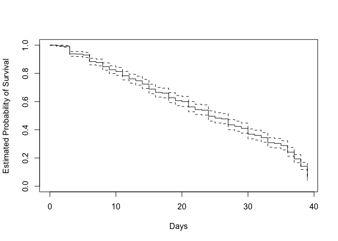
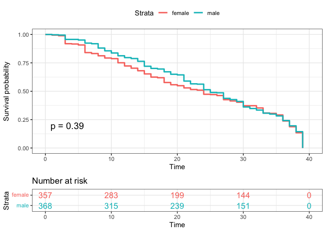

Survival Analysis
================
2022-11-26

## Survival Analysis

#### reading in data

``` r
survivor_data_final = 
  read.csv("survivor_data_final")
```

``` r
# filtering of seasons moved to data wrangling file
# replaced all survivor_final with survivor_data_final since filtering was moved to use for EDA

status <- c()
time <- c()
for (i in 1:nrow(survivor_data_final))
  {
  if(survivor_data_final[i,16] == "Quit"){
    status[i] <- 0
    time[i] <- survivor_data_final$days_survived[i]
  }
  else if(survivor_data_final[i,16] == "Sole Survivor"){
    status[i] <- 0
    time[i] <- survivor_data_final$days_survived[i]
  } 
  else if(survivor_data_final[i,16] == "Runner-up"){
    status[i] <- 0
    time[i] <- survivor_data_final$days_survived[i]
  } else if(survivor_data_final[i,16] == "Co-runner-up"){
    status[i] <- 0
    time[i] <- survivor_data_final$days_survived[i]
  }
  else {
    status[i] <- 1
    time[i] <- survivor_data_final$days_survived[i]
  }
}
survivor_data_final[,18] <- status
survivor_data_final[,19] <- time

colnames(survivor_data_final)[18] <- "status"
colnames(survivor_data_final)[19] <- "time"
```

#### Create time and status variable

``` r
# filtering of seasons moved to data wrangling file

status <- c()
time <- c()
for (i in 1:nrow(survivor_data_final))
  {
  if(survivor_data_final[i,16] == "Quit"){
    status[i] <- 0
    time[i] <- survivor_data_final$days_survived[i]
  }
  else if(survivor_data_final[i,16] == "Sole Survivor"){
    status[i] <- 0
    time[i] <- survivor_data_final$days_survived[i]
  } 
  else if(survivor_data_final[i,16] == "Runner-up"){
    status[i] <- 0
    time[i] <- survivor_data_final$days_survived[i]
  } else if(survivor_data_final[i,16] == "Co-runner-up"){
    status[i] <- 0
    time[i] <- survivor_data_final$days_survived[i]
  }
  else {
    status[i] <- 1
    time[i] <- survivor_data_final$days_survived[i]
  }
}
survivor_data_final[,18] <- status
survivor_data_final[,19] <- time

colnames(survivor_data_final)[18] <- "status"
colnames(survivor_data_final)[19] <- "time"
```

## Survival Unadjected Model

``` r
surv_model_unadj <- survfit(Surv(time, status) ~ 1)

plot(surv_model_unadj, xlab = "Days",
     ylab = "Estimated Probability of Survival")
```

<!-- -->

## Cox-proposional hazard model 1

``` r
surv_model_cox1 <- coxph(data = survivor_data_final,
  Surv(time, status) ~  poc + age_during_show + personality_type_binary)

summary(surv_model_cox1)
```

    ## Call:
    ## coxph(formula = Surv(time, status) ~ poc + age_during_show + 
    ##     personality_type_binary, data = survivor_data_final)
    ## 
    ##   n= 721, number of events= 721 
    ##    (25 observations deleted due to missingness)
    ## 
    ##                                        coef  exp(coef)   se(coef)      z
    ## pocWhite                         -0.0850812  0.9184377  0.0835671 -1.018
    ## age_during_show                  -0.0001841  0.9998159  0.0037273 -0.049
    ## personality_type_binaryIntrovert  0.0593713  1.0611692  0.0752142  0.789
    ##                                  Pr(>|z|)
    ## pocWhite                            0.309
    ## age_during_show                     0.961
    ## personality_type_binaryIntrovert    0.430
    ## 
    ##                                  exp(coef) exp(-coef) lower .95 upper .95
    ## pocWhite                            0.9184     1.0888    0.7797     1.082
    ## age_during_show                     0.9998     1.0002    0.9925     1.007
    ## personality_type_binaryIntrovert    1.0612     0.9424    0.9157     1.230
    ## 
    ## Concordance= 0.517  (se = 0.014 )
    ## Likelihood ratio test= 1.77  on 3 df,   p=0.6
    ## Wald test            = 1.78  on 3 df,   p=0.6
    ## Score (logrank) test = 1.79  on 3 df,   p=0.6

## Cox-proposional hazard model 2

``` r
surv_model_cox2 <- coxph(data = survivor_data_final,
  Surv(time, status) ~  ethnicity + age_during_show + personality_type_binary)

summary(surv_model_cox2)
```

    ## Call:
    ## coxph(formula = Surv(time, status) ~ ethnicity + age_during_show + 
    ##     personality_type_binary, data = survivor_data_final)
    ## 
    ##   n= 687, number of events= 687 
    ##    (59 observations deleted due to missingness)
    ## 
    ##                                        coef  exp(coef)   se(coef)      z
    ## ethnicityAsian, Black             3.339e+00  2.818e+01  1.025e+00  3.257
    ## ethnicityBlack                    1.969e-02  1.020e+00  1.743e-01  0.113
    ## ethnicityBrazilian               -2.521e-01  7.772e-01  7.232e-01 -0.349
    ## ethnicityChilean American         1.753e+00  5.771e+00  1.016e+00  1.726
    ## ethnicityColombian American      -1.193e-01  8.875e-01  1.012e+00 -0.118
    ## ethnicityCuban American           3.754e-01  1.456e+00  7.218e-01  0.520
    ## ethnicityMexican American        -1.327e-01  8.757e-01  4.041e-01 -0.328
    ## ethnicityPanamanian American      3.400e+00  2.997e+01  1.027e+00  3.312
    ## ethnicityPeruvian American        1.881e+00  6.560e+00  1.014e+00  1.854
    ## ethnicityPuerto Rican American   -1.949e-01  8.229e-01  7.211e-01 -0.270
    ## ethnicityVenezuelan American      1.119e+00  3.062e+00  1.012e+00  1.106
    ## ethnicityWhite                   -5.675e-02  9.448e-01  1.470e-01 -0.386
    ## age_during_show                  -5.681e-05  9.999e-01  3.800e-03 -0.015
    ## personality_type_binaryIntrovert  6.203e-02  1.064e+00  7.861e-02  0.789
    ##                                  Pr(>|z|)    
    ## ethnicityAsian, Black            0.001125 ** 
    ## ethnicityBlack                   0.910018    
    ## ethnicityBrazilian               0.727461    
    ## ethnicityChilean American        0.084348 .  
    ## ethnicityColombian American      0.906116    
    ## ethnicityCuban American          0.602975    
    ## ethnicityMexican American        0.742668    
    ## ethnicityPanamanian American     0.000927 ***
    ## ethnicityPeruvian American       0.063704 .  
    ## ethnicityPuerto Rican American   0.786935    
    ## ethnicityVenezuelan American     0.268768    
    ## ethnicityWhite                   0.699538    
    ## age_during_show                  0.988074    
    ## personality_type_binaryIntrovert 0.430060    
    ## ---
    ## Signif. codes:  0 '***' 0.001 '**' 0.01 '*' 0.05 '.' 0.1 ' ' 1
    ## 
    ##                                  exp(coef) exp(-coef) lower .95 upper .95
    ## ethnicityAsian, Black              28.1822    0.03548    3.7799   210.120
    ## ethnicityBlack                      1.0199    0.98050    0.7248     1.435
    ## ethnicityBrazilian                  0.7772    1.28667    0.1883     3.207
    ## ethnicityChilean American           5.7711    0.17328    0.7885    42.239
    ## ethnicityColombian American         0.8875    1.12674    0.1222     6.447
    ## ethnicityCuban American             1.4556    0.68701    0.3537     5.990
    ## ethnicityMexican American           0.8757    1.14189    0.3966     1.934
    ## ethnicityPanamanian American       29.9687    0.03337    4.0068   224.151
    ## ethnicityPeruvian American          6.5603    0.15243    0.8983    47.910
    ## ethnicityPuerto Rican American      0.8229    1.21519    0.2003     3.382
    ## ethnicityVenezuelan American        3.0623    0.32655    0.4213    22.256
    ## ethnicityWhite                      0.9448    1.05839    0.7083     1.260
    ## age_during_show                     0.9999    1.00006    0.9925     1.007
    ## personality_type_binaryIntrovert    1.0640    0.93986    0.9121     1.241
    ## 
    ## Concordance= 0.519  (se = 0.014 )
    ## Likelihood ratio test= 16.39  on 14 df,   p=0.3
    ## Wald test            = 31.35  on 14 df,   p=0.005
    ## Score (logrank) test = 64.51  on 14 df,   p=2e-08

## Kaplan-Meier plotter-personality

``` r
surv_model_per <- survfit(Surv(time, status)~ survivor_data_final$personality_type_binary)

ggsurvplot(
  surv_model_per,
  data = survivor_data_final,
  size = 1,                 # change line size
  palette =
    c("#E7B800", "#2E9FDF"),# custom color palettes
  conf.int = FALSE,          # Add confidence interval
  pval = TRUE,              # Add p-value
  risk.table = TRUE,        # Add risk table
  risk.table.col = "strata",# Risk table color by groups
  legend.labs =
    c("Extrovert", "Introvert"),    # Change legend labels
  risk.table.height = 0.25, # Useful to change when you have multiple groups
  ggtheme = theme_bw()      # Change ggplot2 theme
)
```

<!-- -->

``` r
#basic graph
# plot(surv_model_per, xlab = "Days",
#      ylab = "Estimated Probability of Survival", col = c(2,4))
```

## Kaplan-Meier plotter-White vs Non-White

``` r
surv_model_poc <- survfit(Surv(time, status)~ survivor_data_final$poc)

ggsurvplot(
  surv_model_poc,
  data = survivor_data_final,
  size = 1,                 # change line size
  conf.int = FALSE,          # Add confidence interval
  pval = TRUE,              # Add p-value
  risk.table = TRUE,        # Add risk table
  risk.table.col = "strata",# Risk table color by groups
  legend.labs =
    c("POC", "White"),    # Change legend labels
  risk.table.height = 0.25, # Useful to change when you have multiple groups
  ggtheme = theme_bw()      # Change ggplot2 theme
)
```

<!-- -->

## Kaplan-Meier plotter-gender

``` r
surv_model_sex <- survfit(Surv(time, status)~ survivor_data_final$gender)

ggsurvplot(
  surv_model_sex,
  data = survivor_data_final,
  size = 1,                 # change line size
  conf.int = FALSE,          # Add confidence interval
  pval = TRUE,              # Add p-value
  risk.table = TRUE,        # Add risk table
  risk.table.col = "strata",# Risk table color by groups
  legend.labs =
    c("female", "male"),    # Change legend labels
  risk.table.height = 0.25, # Useful to change when you have multiple groups
  ggtheme = theme_bw()      # Change ggplot2 theme
)
```

<!-- -->

## log-rank
