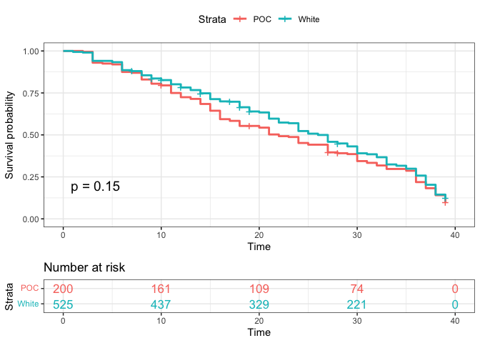
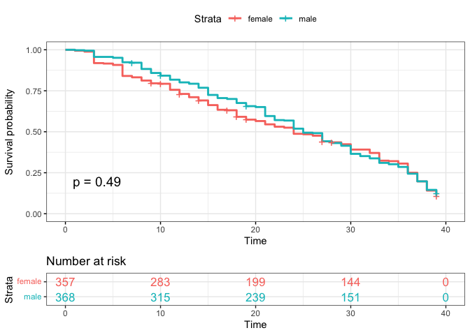

Survival Analysis
================
2022-11-26

``` r
## calculating percent NAs for all variables
survivor_data_final %>% summarise_all(list(name = ~sum(is.na(.))/length(.)))
```

    ## # A tibble: 1 × 17
    ##   version_seas…¹ full_…² age_d…³ race_…⁴ poc_n…⁵ date_…⁶ date_…⁷ occup…⁸ gende…⁹
    ##            <dbl>   <dbl>   <dbl>   <dbl>   <dbl>   <dbl>   <dbl>   <dbl>   <dbl>
    ## 1              0       0       0   0.724 0.00627 0.00877   0.985 0.00627 0.00627
    ## # … with 8 more variables: ethnicity_name <dbl>,
    ## #   personality_type_binary_name <dbl>, episode_name <dbl>,
    ## #   days_survived_name <dbl>, order_name <dbl>, contestant_count_name <dbl>,
    ## #   result_name <dbl>, percent_survived_name <dbl>, and abbreviated variable
    ## #   names ¹​version_season_name, ²​full_name_name, ³​age_during_show_name,
    ## #   ⁴​race_name, ⁵​poc_name, ⁶​date_of_birth_name, ⁷​date_of_death_name,
    ## #   ⁸​occupation_name, ⁹​gender_name

## EDA (rough draft of tables)

``` r
## overall summary table
survivor_data_final %>% 
  select(gender, poc, personality_type_binary, age_during_show, days_survived) %>% 
  tbl_summary(type = list(gender~ "categorical", poc~ "categorical", personality_type_binary~ "categorical", age_during_show ~ "continuous", days_survived ~ "continuous"), statistic = list(all_continuous() ~ "{mean} ({sd})"))
```

<div id="uyhwdbnvlr" style="overflow-x:auto;overflow-y:auto;width:auto;height:auto;">
<style>html {
  font-family: -apple-system, BlinkMacSystemFont, 'Segoe UI', Roboto, Oxygen, Ubuntu, Cantarell, 'Helvetica Neue', 'Fira Sans', 'Droid Sans', Arial, sans-serif;
}

#uyhwdbnvlr .gt_table {
  display: table;
  border-collapse: collapse;
  margin-left: auto;
  margin-right: auto;
  color: #333333;
  font-size: 16px;
  font-weight: normal;
  font-style: normal;
  background-color: #FFFFFF;
  width: auto;
  border-top-style: solid;
  border-top-width: 2px;
  border-top-color: #A8A8A8;
  border-right-style: none;
  border-right-width: 2px;
  border-right-color: #D3D3D3;
  border-bottom-style: solid;
  border-bottom-width: 2px;
  border-bottom-color: #A8A8A8;
  border-left-style: none;
  border-left-width: 2px;
  border-left-color: #D3D3D3;
}

#uyhwdbnvlr .gt_heading {
  background-color: #FFFFFF;
  text-align: center;
  border-bottom-color: #FFFFFF;
  border-left-style: none;
  border-left-width: 1px;
  border-left-color: #D3D3D3;
  border-right-style: none;
  border-right-width: 1px;
  border-right-color: #D3D3D3;
}

#uyhwdbnvlr .gt_title {
  color: #333333;
  font-size: 125%;
  font-weight: initial;
  padding-top: 4px;
  padding-bottom: 4px;
  padding-left: 5px;
  padding-right: 5px;
  border-bottom-color: #FFFFFF;
  border-bottom-width: 0;
}

#uyhwdbnvlr .gt_subtitle {
  color: #333333;
  font-size: 85%;
  font-weight: initial;
  padding-top: 0;
  padding-bottom: 6px;
  padding-left: 5px;
  padding-right: 5px;
  border-top-color: #FFFFFF;
  border-top-width: 0;
}

#uyhwdbnvlr .gt_bottom_border {
  border-bottom-style: solid;
  border-bottom-width: 2px;
  border-bottom-color: #D3D3D3;
}

#uyhwdbnvlr .gt_col_headings {
  border-top-style: solid;
  border-top-width: 2px;
  border-top-color: #D3D3D3;
  border-bottom-style: solid;
  border-bottom-width: 2px;
  border-bottom-color: #D3D3D3;
  border-left-style: none;
  border-left-width: 1px;
  border-left-color: #D3D3D3;
  border-right-style: none;
  border-right-width: 1px;
  border-right-color: #D3D3D3;
}

#uyhwdbnvlr .gt_col_heading {
  color: #333333;
  background-color: #FFFFFF;
  font-size: 100%;
  font-weight: normal;
  text-transform: inherit;
  border-left-style: none;
  border-left-width: 1px;
  border-left-color: #D3D3D3;
  border-right-style: none;
  border-right-width: 1px;
  border-right-color: #D3D3D3;
  vertical-align: bottom;
  padding-top: 5px;
  padding-bottom: 6px;
  padding-left: 5px;
  padding-right: 5px;
  overflow-x: hidden;
}

#uyhwdbnvlr .gt_column_spanner_outer {
  color: #333333;
  background-color: #FFFFFF;
  font-size: 100%;
  font-weight: normal;
  text-transform: inherit;
  padding-top: 0;
  padding-bottom: 0;
  padding-left: 4px;
  padding-right: 4px;
}

#uyhwdbnvlr .gt_column_spanner_outer:first-child {
  padding-left: 0;
}

#uyhwdbnvlr .gt_column_spanner_outer:last-child {
  padding-right: 0;
}

#uyhwdbnvlr .gt_column_spanner {
  border-bottom-style: solid;
  border-bottom-width: 2px;
  border-bottom-color: #D3D3D3;
  vertical-align: bottom;
  padding-top: 5px;
  padding-bottom: 5px;
  overflow-x: hidden;
  display: inline-block;
  width: 100%;
}

#uyhwdbnvlr .gt_group_heading {
  padding-top: 8px;
  padding-bottom: 8px;
  padding-left: 5px;
  padding-right: 5px;
  color: #333333;
  background-color: #FFFFFF;
  font-size: 100%;
  font-weight: initial;
  text-transform: inherit;
  border-top-style: solid;
  border-top-width: 2px;
  border-top-color: #D3D3D3;
  border-bottom-style: solid;
  border-bottom-width: 2px;
  border-bottom-color: #D3D3D3;
  border-left-style: none;
  border-left-width: 1px;
  border-left-color: #D3D3D3;
  border-right-style: none;
  border-right-width: 1px;
  border-right-color: #D3D3D3;
  vertical-align: middle;
}

#uyhwdbnvlr .gt_empty_group_heading {
  padding: 0.5px;
  color: #333333;
  background-color: #FFFFFF;
  font-size: 100%;
  font-weight: initial;
  border-top-style: solid;
  border-top-width: 2px;
  border-top-color: #D3D3D3;
  border-bottom-style: solid;
  border-bottom-width: 2px;
  border-bottom-color: #D3D3D3;
  vertical-align: middle;
}

#uyhwdbnvlr .gt_from_md > :first-child {
  margin-top: 0;
}

#uyhwdbnvlr .gt_from_md > :last-child {
  margin-bottom: 0;
}

#uyhwdbnvlr .gt_row {
  padding-top: 8px;
  padding-bottom: 8px;
  padding-left: 5px;
  padding-right: 5px;
  margin: 10px;
  border-top-style: solid;
  border-top-width: 1px;
  border-top-color: #D3D3D3;
  border-left-style: none;
  border-left-width: 1px;
  border-left-color: #D3D3D3;
  border-right-style: none;
  border-right-width: 1px;
  border-right-color: #D3D3D3;
  vertical-align: middle;
  overflow-x: hidden;
}

#uyhwdbnvlr .gt_stub {
  color: #333333;
  background-color: #FFFFFF;
  font-size: 100%;
  font-weight: initial;
  text-transform: inherit;
  border-right-style: solid;
  border-right-width: 2px;
  border-right-color: #D3D3D3;
  padding-left: 5px;
  padding-right: 5px;
}

#uyhwdbnvlr .gt_stub_row_group {
  color: #333333;
  background-color: #FFFFFF;
  font-size: 100%;
  font-weight: initial;
  text-transform: inherit;
  border-right-style: solid;
  border-right-width: 2px;
  border-right-color: #D3D3D3;
  padding-left: 5px;
  padding-right: 5px;
  vertical-align: top;
}

#uyhwdbnvlr .gt_row_group_first td {
  border-top-width: 2px;
}

#uyhwdbnvlr .gt_summary_row {
  color: #333333;
  background-color: #FFFFFF;
  text-transform: inherit;
  padding-top: 8px;
  padding-bottom: 8px;
  padding-left: 5px;
  padding-right: 5px;
}

#uyhwdbnvlr .gt_first_summary_row {
  border-top-style: solid;
  border-top-color: #D3D3D3;
}

#uyhwdbnvlr .gt_first_summary_row.thick {
  border-top-width: 2px;
}

#uyhwdbnvlr .gt_last_summary_row {
  padding-top: 8px;
  padding-bottom: 8px;
  padding-left: 5px;
  padding-right: 5px;
  border-bottom-style: solid;
  border-bottom-width: 2px;
  border-bottom-color: #D3D3D3;
}

#uyhwdbnvlr .gt_grand_summary_row {
  color: #333333;
  background-color: #FFFFFF;
  text-transform: inherit;
  padding-top: 8px;
  padding-bottom: 8px;
  padding-left: 5px;
  padding-right: 5px;
}

#uyhwdbnvlr .gt_first_grand_summary_row {
  padding-top: 8px;
  padding-bottom: 8px;
  padding-left: 5px;
  padding-right: 5px;
  border-top-style: double;
  border-top-width: 6px;
  border-top-color: #D3D3D3;
}

#uyhwdbnvlr .gt_striped {
  background-color: rgba(128, 128, 128, 0.05);
}

#uyhwdbnvlr .gt_table_body {
  border-top-style: solid;
  border-top-width: 2px;
  border-top-color: #D3D3D3;
  border-bottom-style: solid;
  border-bottom-width: 2px;
  border-bottom-color: #D3D3D3;
}

#uyhwdbnvlr .gt_footnotes {
  color: #333333;
  background-color: #FFFFFF;
  border-bottom-style: none;
  border-bottom-width: 2px;
  border-bottom-color: #D3D3D3;
  border-left-style: none;
  border-left-width: 2px;
  border-left-color: #D3D3D3;
  border-right-style: none;
  border-right-width: 2px;
  border-right-color: #D3D3D3;
}

#uyhwdbnvlr .gt_footnote {
  margin: 0px;
  font-size: 90%;
  padding-left: 4px;
  padding-right: 4px;
  padding-left: 5px;
  padding-right: 5px;
}

#uyhwdbnvlr .gt_sourcenotes {
  color: #333333;
  background-color: #FFFFFF;
  border-bottom-style: none;
  border-bottom-width: 2px;
  border-bottom-color: #D3D3D3;
  border-left-style: none;
  border-left-width: 2px;
  border-left-color: #D3D3D3;
  border-right-style: none;
  border-right-width: 2px;
  border-right-color: #D3D3D3;
}

#uyhwdbnvlr .gt_sourcenote {
  font-size: 90%;
  padding-top: 4px;
  padding-bottom: 4px;
  padding-left: 5px;
  padding-right: 5px;
}

#uyhwdbnvlr .gt_left {
  text-align: left;
}

#uyhwdbnvlr .gt_center {
  text-align: center;
}

#uyhwdbnvlr .gt_right {
  text-align: right;
  font-variant-numeric: tabular-nums;
}

#uyhwdbnvlr .gt_font_normal {
  font-weight: normal;
}

#uyhwdbnvlr .gt_font_bold {
  font-weight: bold;
}

#uyhwdbnvlr .gt_font_italic {
  font-style: italic;
}

#uyhwdbnvlr .gt_super {
  font-size: 65%;
}

#uyhwdbnvlr .gt_footnote_marks {
  font-style: italic;
  font-weight: normal;
  font-size: 75%;
  vertical-align: 0.4em;
}

#uyhwdbnvlr .gt_asterisk {
  font-size: 100%;
  vertical-align: 0;
}

#uyhwdbnvlr .gt_indent_1 {
  text-indent: 5px;
}

#uyhwdbnvlr .gt_indent_2 {
  text-indent: 10px;
}

#uyhwdbnvlr .gt_indent_3 {
  text-indent: 15px;
}

#uyhwdbnvlr .gt_indent_4 {
  text-indent: 20px;
}

#uyhwdbnvlr .gt_indent_5 {
  text-indent: 25px;
}
</style>
<table class="gt_table">
  
  <thead class="gt_col_headings">
    <tr>
      <th class="gt_col_heading gt_columns_bottom_border gt_left" rowspan="1" colspan="1" scope="col"><strong>Characteristic</strong></th>
      <th class="gt_col_heading gt_columns_bottom_border gt_center" rowspan="1" colspan="1" scope="col"><strong>N = 798</strong><sup class="gt_footnote_marks">1</sup></th>
    </tr>
  </thead>
  <tbody class="gt_table_body">
    <tr><td class="gt_row gt_left">gender</td>
<td class="gt_row gt_center"></td></tr>
    <tr><td class="gt_row gt_left" style="text-align: left; text-indent: 10px;">Female</td>
<td class="gt_row gt_center">389 (49%)</td></tr>
    <tr><td class="gt_row gt_left" style="text-align: left; text-indent: 10px;">Male</td>
<td class="gt_row gt_center">403 (51%)</td></tr>
    <tr><td class="gt_row gt_left" style="text-align: left; text-indent: 10px;">Non-binary</td>
<td class="gt_row gt_center">1 (0.1%)</td></tr>
    <tr><td class="gt_row gt_left" style="text-align: left; text-indent: 10px;">Unknown</td>
<td class="gt_row gt_center">5</td></tr>
    <tr><td class="gt_row gt_left">poc</td>
<td class="gt_row gt_center"></td></tr>
    <tr><td class="gt_row gt_left" style="text-align: left; text-indent: 10px;">POC</td>
<td class="gt_row gt_center">233 (29%)</td></tr>
    <tr><td class="gt_row gt_left" style="text-align: left; text-indent: 10px;">White</td>
<td class="gt_row gt_center">560 (71%)</td></tr>
    <tr><td class="gt_row gt_left" style="text-align: left; text-indent: 10px;">Unknown</td>
<td class="gt_row gt_center">5</td></tr>
    <tr><td class="gt_row gt_left">personality_type_binary</td>
<td class="gt_row gt_center"></td></tr>
    <tr><td class="gt_row gt_left" style="text-align: left; text-indent: 10px;">Extrovert</td>
<td class="gt_row gt_center">433 (56%)</td></tr>
    <tr><td class="gt_row gt_left" style="text-align: left; text-indent: 10px;">Introvert</td>
<td class="gt_row gt_center">339 (44%)</td></tr>
    <tr><td class="gt_row gt_left" style="text-align: left; text-indent: 10px;">Unknown</td>
<td class="gt_row gt_center">26</td></tr>
    <tr><td class="gt_row gt_left">age_during_show</td>
<td class="gt_row gt_center">33 (10)</td></tr>
    <tr><td class="gt_row gt_left">days_survived</td>
<td class="gt_row gt_center">23 (12)</td></tr>
    <tr><td class="gt_row gt_left" style="text-align: left; text-indent: 10px;">Unknown</td>
<td class="gt_row gt_center">17</td></tr>
  </tbody>
  
  <tfoot class="gt_footnotes">
    <tr>
      <td class="gt_footnote" colspan="2"><sup class="gt_footnote_marks">1</sup> n (%); Mean (SD)</td>
    </tr>
  </tfoot>
</table>
</div>

``` r
## days survived by variables of interest
## personality type
## done with days survived (can replace with standardized percents if we change survival analysis)
  
survivor_data_final %>% 
  group_by(personality_type_binary) %>% 
  summarize(n_personality_type = n(),
            mean_days_survived = mean(days_survived)) %>% 
    na.omit()  %>%
  knitr::kable(digits = 3, col.names = c("Personality Type", "n", "Mean Days Survived"))
```

| Personality Type |   n | Mean Days Survived |
|:-----------------|----:|-------------------:|
| Extrovert        | 433 |             23.647 |
| Introvert        | 339 |             23.257 |

``` r
## POC
survivor_data_final %>% 
  group_by(poc) %>% 
  summarize(n_poc = n(),
            mean_days_survived = mean(days_survived, na.rm = TRUE)) %>% 
    na.omit()  %>%
  knitr::kable(digits = 3, col.names = c("POC", "n", "Mean Days Survived"))
```

| POC   |   n | Mean Days Survived |
|:------|----:|-------------------:|
| POC   | 233 |             22.067 |
| White | 560 |             23.969 |

``` r
## gender
survivor_data_final %>% 
  group_by(gender) %>% 
  summarize(n_gender= n(),
            mean_days_survived = mean(days_survived, na.rm = TRUE)) %>%
    na.omit()  %>%
  knitr::kable(digits = 3, col.names = c("Gender", "n", "Mean Days Survived"))
```

| Gender     |   n | Mean Days Survived |
|:-----------|----:|-------------------:|
| Female     | 389 |             22.682 |
| Male       | 403 |             24.155 |
| Non-binary |   1 |             17.000 |

## Survival Analysis

#### Create new variable ethnicity

``` r
survivor_data_final <- survivor_data_final %>%
  mutate(ethnicity = ifelse(
      str_detect(poc, 'White'), survivor_data_final$poc, survivor_data_final$race))
```

#### Create time and status variable

``` r
## drop missing values of days_survived where all US43 seasons participants
survivor_final <- drop_na(survivor_data_final, days_survived)

## time to event: in this data, the event is voted out
## time is 39 days
## censors are participant who survived for 39 days and participant who quit the game

check_length_time <- survivor_data_final %>% 
  filter(result %in% c("Sole Survivor","Co-runner-up","Runner-up"))

## season 41 and 42, the longest survival time is 26 days, exclude these seasons
## season 2, the longest survival time is 42 days, exclude this season
survivor_final <- survivor_final %>% 
  filter(version_season != "US02") %>%
  filter(version_season != "US41") %>%
  filter(version_season != "US42") %>%
  mutate(personality_type_binary = as.factor(personality_type_binary))

status <- c()
time <- c()
for (i in 1:nrow(survivor_final))
  {
  if(survivor_final[i,16] == "Quit"){
    status[i] <- 0
    time[i] <- survivor_final$days_survived[i]
  }
  else if(survivor_final[i,16] == "Sole Survivor"){
    status[i] <- 0
    time[i] <- survivor_final$days_survived[i]
  } 
  else if(survivor_final[i,16] == "Runner-up"){
    status[i] <- 0
    time[i] <- survivor_final$days_survived[i]
  } else if(survivor_final[i,16] == "Co-runner-up"){
    status[i] <- 0
    time[i] <- survivor_final$days_survived[i]
  }
  else {
    status[i] <- 1
    time[i] <- survivor_final$days_survived[i]
  }
}
survivor_final[,18] <- status
survivor_final[,19] <- time

colnames(survivor_final)[18] <- "status"
colnames(survivor_final)[19] <- "time"
```

## Survival Unadjected Model

``` r
surv_model_unadj <- survfit(Surv(time, status) ~ 1)

plot(surv_model_unadj, xlab = "Days",
     ylab = "Estimated Probability of Survival")
```

<!-- -->

## Cox-proposional hazard model 1

``` r
surv_model_cox1 <- coxph(data = survivor_final,
  Surv(time, status) ~  poc + age_during_show + personality_type_binary)

summary(surv_model_cox1)
```

    ## Call:
    ## coxph(formula = Surv(time, status) ~ poc + age_during_show + 
    ##     personality_type_binary, data = survivor_final)
    ## 
    ##   n= 721, number of events= 626 
    ##    (8 observations deleted due to missingness)
    ## 
    ##                                        coef  exp(coef)   se(coef)      z
    ## pocWhite                         -1.186e-01  8.881e-01  8.923e-02 -1.330
    ## age_during_show                  -8.572e-06  1.000e+00  3.976e-03 -0.002
    ## personality_type_binaryIntrovert  6.114e-02  1.063e+00  8.065e-02  0.758
    ##                                  Pr(>|z|)
    ## pocWhite                            0.184
    ## age_during_show                     0.998
    ## personality_type_binaryIntrovert    0.448
    ## 
    ##                                  exp(coef) exp(-coef) lower .95 upper .95
    ## pocWhite                            0.8881     1.1260    0.7456     1.058
    ## age_during_show                     1.0000     1.0000    0.9922     1.008
    ## personality_type_binaryIntrovert    1.0631     0.9407    0.9076     1.245
    ## 
    ## Concordance= 0.517  (se = 0.014 )
    ## Likelihood ratio test= 2.47  on 3 df,   p=0.5
    ## Wald test            = 2.5  on 3 df,   p=0.5
    ## Score (logrank) test = 2.51  on 3 df,   p=0.5

## Cox-proposional hazard model 2

``` r
surv_model_cox2 <- coxph(data = survivor_final,
  Surv(time, status) ~  ethnicity + age_during_show + personality_type_binary)

summary(surv_model_cox2)
```

    ## Call:
    ## coxph(formula = Surv(time, status) ~ ethnicity + age_during_show + 
    ##     personality_type_binary, data = survivor_final)
    ## 
    ##   n= 687, number of events= 596 
    ##    (42 observations deleted due to missingness)
    ## 
    ##                                        coef  exp(coef)   se(coef)      z
    ## ethnicityAsian, Black             3.2903748 26.8529253  1.0259043  3.207
    ## ethnicityBlack                   -0.0013271  0.9986737  0.1847155 -0.007
    ## ethnicityBrazilian               -0.2720196  0.7618393  0.7249443 -0.375
    ## ethnicityChilean American         1.7268978  5.6231827  1.0168787  1.698
    ## ethnicityColombian American      -0.1342845  0.8743413  1.0129903 -0.133
    ## ethnicityCuban American          -0.3704447  0.6904272  1.0113371 -0.366
    ## ethnicityMexican American        -0.1970779  0.8211267  0.4350155 -0.453
    ## ethnicityPanamanian American      3.3588111 28.7549837  1.0278275  3.268
    ## ethnicityPeruvian American        1.8464144  6.3370565  1.0154234  1.818
    ## ethnicityPuerto Rican American   -0.2202243  0.8023388  0.7223740 -0.305
    ## ethnicityVenezuelan American      1.1023898  3.0113541  1.0129948  1.088
    ## ethnicityWhite                   -0.1095644  0.8962244  0.1552187 -0.706
    ## age_during_show                   0.0002771  1.0002771  0.0040463  0.068
    ## personality_type_binaryIntrovert  0.0656655  1.0678694  0.0845104  0.777
    ##                                  Pr(>|z|)   
    ## ethnicityAsian, Black             0.00134 **
    ## ethnicityBlack                    0.99427   
    ## ethnicityBrazilian                0.70749   
    ## ethnicityChilean American         0.08946 . 
    ## ethnicityColombian American       0.89454   
    ## ethnicityCuban American           0.71415   
    ## ethnicityMexican American         0.65052   
    ## ethnicityPanamanian American      0.00108 **
    ## ethnicityPeruvian American        0.06901 . 
    ## ethnicityPuerto Rican American    0.76047   
    ## ethnicityVenezuelan American      0.27649   
    ## ethnicityWhite                    0.48027   
    ## age_during_show                   0.94540   
    ## personality_type_binaryIntrovert  0.43715   
    ## ---
    ## Signif. codes:  0 '***' 0.001 '**' 0.01 '*' 0.05 '.' 0.1 ' ' 1
    ## 
    ##                                  exp(coef) exp(-coef) lower .95 upper .95
    ## ethnicityAsian, Black              26.8529    0.03724   3.59534   200.559
    ## ethnicityBlack                      0.9987    1.00133   0.69533     1.434
    ## ethnicityBrazilian                  0.7618    1.31261   0.18399     3.155
    ## ethnicityChilean American           5.6232    0.17784   0.76633    41.262
    ## ethnicityColombian American         0.8743    1.14372   0.12007     6.367
    ## ethnicityCuban American             0.6904    1.44838   0.09512     5.012
    ## ethnicityMexican American           0.8211    1.21784   0.35005     1.926
    ## ethnicityPanamanian American       28.7550    0.03478   3.83552   215.577
    ## ethnicityPeruvian American          6.3371    0.15780   0.86608    46.368
    ## ethnicityPuerto Rican American      0.8023    1.24636   0.19475     3.306
    ## ethnicityVenezuelan American        3.0114    0.33208   0.41352    21.929
    ## ethnicityWhite                      0.8962    1.11579   0.66114     1.215
    ## age_during_show                     1.0003    0.99972   0.99238     1.008
    ## personality_type_binaryIntrovert    1.0679    0.93644   0.90486     1.260
    ## 
    ## Concordance= 0.532  (se = 0.013 )
    ## Likelihood ratio test= 16.88  on 14 df,   p=0.3
    ## Wald test            = 31.88  on 14 df,   p=0.004
    ## Score (logrank) test = 65.12  on 14 df,   p=1e-08

## Kaplan-Meier plotter-personality

``` r
surv_model_per <- survfit(Surv(time, status)~ survivor_final$personality_type_binary)

ggsurvplot(
  surv_model_per,
  data = survivor_final,
  size = 1,                 # change line size
  palette =
    c("#E7B800", "#2E9FDF"),# custom color palettes
  conf.int = FALSE,          # Add confidence interval
  pval = TRUE,              # Add p-value
  risk.table = TRUE,        # Add risk table
  risk.table.col = "strata",# Risk table color by groups
  legend.labs =
    c("Extrovert", "Introvert"),    # Change legend labels
  risk.table.height = 0.25, # Useful to change when you have multiple groups
  ggtheme = theme_bw()      # Change ggplot2 theme
)
```

<!-- -->

``` r
#basic graph
# plot(surv_model_per, xlab = "Days",
#      ylab = "Estimated Probability of Survival", col = c(2,4))
```

## Kaplan-Meier plotter-White vs Non-White

``` r
surv_model_poc <- survfit(Surv(time, status)~ survivor_final$poc)

ggsurvplot(
  surv_model_poc,
  data = survivor_final,
  size = 1,                 # change line size
  conf.int = FALSE,          # Add confidence interval
  pval = TRUE,              # Add p-value
  risk.table = TRUE,        # Add risk table
  risk.table.col = "strata",# Risk table color by groups
  legend.labs =
    c("POC", "White"),    # Change legend labels
  risk.table.height = 0.25, # Useful to change when you have multiple groups
  ggtheme = theme_bw()      # Change ggplot2 theme
)
```

<!-- -->

## Kaplan-Meier plotter-gender

``` r
surv_model_sex <- survfit(Surv(time, status)~ survivor_final$gender)

ggsurvplot(
  surv_model_sex,
  data = survivor_final,
  size = 1,                 # change line size
  conf.int = FALSE,          # Add confidence interval
  pval = TRUE,              # Add p-value
  risk.table = TRUE,        # Add risk table
  risk.table.col = "strata",# Risk table color by groups
  legend.labs =
    c("female", "male"),    # Change legend labels
  risk.table.height = 0.25, # Useful to change when you have multiple groups
  ggtheme = theme_bw()      # Change ggplot2 theme
)
```

<!-- -->

## log-rank
