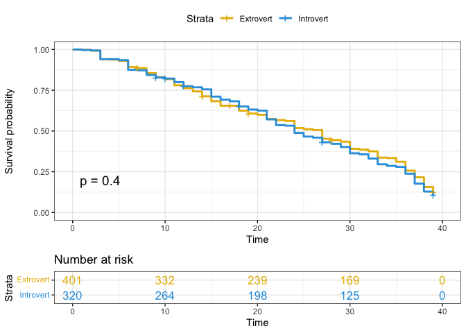
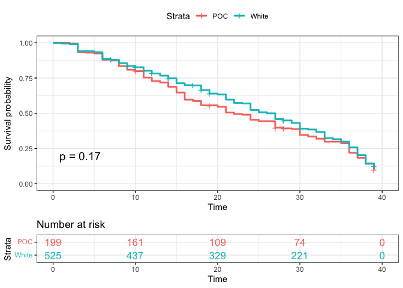

Survival Analysis
================
2022-11-26

Statistical Analysis Methodology For our project, we interest using
Survival Analysis. Suppose that there is a true survival time, T, as
well as a true censoring time, C. The survival time represents the time
at which the event of interest occurs: in this dataset, the time at
which participant is voted out. The censoring time is the time at which
the participant drop out of the game show or survived until the last day
of the show.

We observed the Survival Time T and Censoring Time C. Suppose there is a
random variable Y

$$Y = min(T,C)$$

In other words, if the event occurs before the censoring such that T $<$
C, then we observed the true survival time T. If censoring occurs before
the event such as T $>$ C, then we observe the censoring time. The
status indicator as,

$$\delta = \begin{cases} 
      & 1 &  T\leq C \\
      & 0 & T > C
   \end{cases}$$

Thus, $\delta$ = 1 if we observe the true survival time, and $\delta$ =
0 if we observe the censoring.

## Survival Analysis

``` r
## reading in data
survivor_data_final = 
  read.csv("data/survivor_data_final.csv")
```

## Create status and time variable

``` r
# filtering of seasons moved to data wrangling file
# replaced all survivor_final with survivor_data_final since filtering was moved to use for EDA

status <- c()
time <- c()
for (i in 1:nrow(survivor_data_final))
  {
  if (survivor_data_final[i,17] == "Quit") {
    status[i] <- 0
    time[i] <- survivor_data_final$days_survived[i]
  }
  else if (survivor_data_final[i,17] == "Sole Survivor") {
    status[i] <- 0
    time[i] <- survivor_data_final$days_survived[i]
  } 
  else if (survivor_data_final[i,17] == "Runner-up") {
    status[i] <- 0
    time[i] <- survivor_data_final$days_survived[i]
  } else if (survivor_data_final[i,17] == "Co-runner-up") {
    status[i] <- 0
    time[i] <- survivor_data_final$days_survived[i]
  }
  else {
    status[i] <- 1
    time[i] <- survivor_data_final$days_survived[i]
  }
}
survivor_data_final[,20] <- status
survivor_data_final[,21] <- time

colnames(survivor_data_final)[20] <- "status"
colnames(survivor_data_final)[21] <- "time"
```

## Survival Unadjusted Model

``` r
surv_model_unadj <- survfit(Surv(time, status) ~ 1)

plot(surv_model_unadj, xlab = "Days",
     ylab = "Estimated Probability of Survival")
```

<!-- -->

## Cox-proposional hazard model 1

``` r
surv_model_cox1 <- coxph(data = survivor_data_final,
  Surv(time, status) ~  poc + age_during_show + personality_type_binary)

summary(surv_model_cox1)
```

    ## Call:
    ## coxph(formula = Surv(time, status) ~ poc + age_during_show + 
    ##     personality_type_binary, data = survivor_data_final)
    ## 
    ##   n= 721, number of events= 626 
    ##    (7 observations deleted due to missingness)
    ## 
    ##                                        coef  exp(coef)   se(coef)      z
    ## pocWhite                         -1.186e-01  8.881e-01  8.923e-02 -1.330
    ## age_during_show                  -8.572e-06  1.000e+00  3.976e-03 -0.002
    ## personality_type_binaryIntrovert  6.114e-02  1.063e+00  8.065e-02  0.758
    ##                                  Pr(>|z|)
    ## pocWhite                            0.184
    ## age_during_show                     0.998
    ## personality_type_binaryIntrovert    0.448
    ## 
    ##                                  exp(coef) exp(-coef) lower .95 upper .95
    ## pocWhite                            0.8881     1.1260    0.7456     1.058
    ## age_during_show                     1.0000     1.0000    0.9922     1.008
    ## personality_type_binaryIntrovert    1.0631     0.9407    0.9076     1.245
    ## 
    ## Concordance= 0.517  (se = 0.014 )
    ## Likelihood ratio test= 2.47  on 3 df,   p=0.5
    ## Wald test            = 2.5  on 3 df,   p=0.5
    ## Score (logrank) test = 2.51  on 3 df,   p=0.5

## Cox-proposional hazard model 2

``` r
surv_model_cox2 <- coxph(data = survivor_data_final,
  Surv(time, status) ~  ethnicity + age_during_show + personality_type_binary)

summary(surv_model_cox2)
```

    ## Call:
    ## coxph(formula = Surv(time, status) ~ ethnicity + age_during_show + 
    ##     personality_type_binary, data = survivor_data_final)
    ## 
    ##   n= 687, number of events= 596 
    ##    (41 observations deleted due to missingness)
    ## 
    ##                                        coef  exp(coef)   se(coef)      z
    ## ethnicityAsian, Black             3.2903748 26.8529253  1.0259043  3.207
    ## ethnicityBlack                   -0.0013271  0.9986737  0.1847155 -0.007
    ## ethnicityBrazilian               -0.2720196  0.7618393  0.7249443 -0.375
    ## ethnicityChilean American         1.7268978  5.6231827  1.0168787  1.698
    ## ethnicityColombian American      -0.1342845  0.8743413  1.0129903 -0.133
    ## ethnicityCuban American          -0.3704447  0.6904272  1.0113371 -0.366
    ## ethnicityMexican American        -0.1970779  0.8211267  0.4350155 -0.453
    ## ethnicityPanamanian American      3.3588111 28.7549837  1.0278275  3.268
    ## ethnicityPeruvian American        1.8464144  6.3370565  1.0154234  1.818
    ## ethnicityPuerto Rican American   -0.2202243  0.8023388  0.7223740 -0.305
    ## ethnicityVenezuelan American      1.1023898  3.0113541  1.0129948  1.088
    ## ethnicityWhite                   -0.1095644  0.8962244  0.1552187 -0.706
    ## age_during_show                   0.0002771  1.0002771  0.0040463  0.068
    ## personality_type_binaryIntrovert  0.0656655  1.0678694  0.0845104  0.777
    ##                                  Pr(>|z|)   
    ## ethnicityAsian, Black             0.00134 **
    ## ethnicityBlack                    0.99427   
    ## ethnicityBrazilian                0.70749   
    ## ethnicityChilean American         0.08946 . 
    ## ethnicityColombian American       0.89454   
    ## ethnicityCuban American           0.71415   
    ## ethnicityMexican American         0.65052   
    ## ethnicityPanamanian American      0.00108 **
    ## ethnicityPeruvian American        0.06901 . 
    ## ethnicityPuerto Rican American    0.76047   
    ## ethnicityVenezuelan American      0.27649   
    ## ethnicityWhite                    0.48027   
    ## age_during_show                   0.94540   
    ## personality_type_binaryIntrovert  0.43715   
    ## ---
    ## Signif. codes:  0 '***' 0.001 '**' 0.01 '*' 0.05 '.' 0.1 ' ' 1
    ## 
    ##                                  exp(coef) exp(-coef) lower .95 upper .95
    ## ethnicityAsian, Black              26.8529    0.03724   3.59534   200.559
    ## ethnicityBlack                      0.9987    1.00133   0.69533     1.434
    ## ethnicityBrazilian                  0.7618    1.31261   0.18399     3.155
    ## ethnicityChilean American           5.6232    0.17784   0.76633    41.262
    ## ethnicityColombian American         0.8743    1.14372   0.12007     6.367
    ## ethnicityCuban American             0.6904    1.44838   0.09512     5.012
    ## ethnicityMexican American           0.8211    1.21784   0.35005     1.926
    ## ethnicityPanamanian American       28.7550    0.03478   3.83552   215.577
    ## ethnicityPeruvian American          6.3371    0.15780   0.86608    46.368
    ## ethnicityPuerto Rican American      0.8023    1.24636   0.19475     3.306
    ## ethnicityVenezuelan American        3.0114    0.33208   0.41352    21.929
    ## ethnicityWhite                      0.8962    1.11579   0.66114     1.215
    ## age_during_show                     1.0003    0.99972   0.99238     1.008
    ## personality_type_binaryIntrovert    1.0679    0.93644   0.90486     1.260
    ## 
    ## Concordance= 0.532  (se = 0.013 )
    ## Likelihood ratio test= 16.88  on 14 df,   p=0.3
    ## Wald test            = 31.88  on 14 df,   p=0.004
    ## Score (logrank) test = 65.12  on 14 df,   p=1e-08

**HR interpretations:**

As age increases in years, there is no difference in survival since the
hazard ratio is 1. We are 95% confident that the HR falls between 0.9922
to 1.008. However, the HR is not statistically significant since the
p-value of 0.998 \> 0.05.

For the gender variable, the HR value of 0.96 would suggest that the
survival time for Male contestants compared to Female contestants (the
reference category) is longer. We are 95% confident that the HR falls
between 0.82 and 1.12. However, the HR is not statistically significant
since the p-value of 0.57 \> 0.05.

For the POC variable, the HR value of 0.8881 would suggest that the
survival time for White contestants compared to POC contestants (the
reference category) is longer. We are 95% confident that the HR falls
between 0.7456 and 1.058. However, the HR is not statistically
significant since the p-value of 0.184 \> 0.05.

For personality type, the HR value of 1.0631 would suggest that the
survival time for Introvert contestants compared to Extrovert
contestants (the reference category) is shorter. We are 95% confident
that the HR falls between 0.9076 - 1.245. However, the HR is not
statistically significant since the p-value of 0.448 \> 0.05.

The survival curve, or survival function, is defined as
$$S(t) = Pr(T>t)$$ \## Kaplan-Meier plotter-personality

``` r
surv_model_per <- survfit(Surv(time, status)~ survivor_data_final$personality_type_binary)

ggsurvplot(
  surv_model_per,
  data = survivor_data_final,
  size = 1,                 # change line size
  palette =
    c("#E7B800", "#2E9FDF"),# custom color palettes
  conf.int = FALSE,          # Add confidence interval
  pval = TRUE,              # Add p-value
  risk.table = TRUE,        # Add risk table
  risk.table.col = "strata",# Risk table color by groups
  legend.labs =
    c("Extrovert", "Introvert"),    # Change legend labels
  risk.table.height = 0.25, # Useful to change when you have multiple groups
  ggtheme = theme_bw()      # Change ggplot2 theme
)
```

<!-- -->

``` r
#basic graph
# plot(surv_model_per, xlab = "Days",
#      ylab = "Estimated Probability of Survival", col = c(2,4))
```

## Kaplan-Meier plotter-White vs Non-White

``` r
surv_model_poc <- survfit(Surv(time, status)~ survivor_data_final$poc)

ggsurvplot(
  surv_model_poc,
  data = survivor_data_final,
  size = 1,                 # change line size
  conf.int = FALSE,          # Add confidence interval
  pval = TRUE,              # Add p-value
  risk.table = TRUE,        # Add risk table
  risk.table.col = "strata",# Risk table color by groups
  legend.labs =
    c("POC", "White"),    # Change legend labels
  risk.table.height = 0.25, # Useful to change when you have multiple groups
  ggtheme = theme_bw()      # Change ggplot2 theme
)
```

<!-- -->

## Kaplan-Meier plotter-gender

``` r
surv_model_sex <- survfit(Surv(time, status)~ survivor_data_final$gender)

ggsurvplot(
  surv_model_sex,
  data = survivor_data_final,
  size = 1,                 # change line size
  conf.int = FALSE,          # Add confidence interval
  pval = TRUE,              # Add p-value
  risk.table = TRUE,        # Add risk table
  risk.table.col = "strata",# Risk table color by groups
  legend.labs =
    c("female", "male"),    # Change legend labels
  risk.table.height = 0.25, # Useful to change when you have multiple groups
  ggtheme = theme_bw()      # Change ggplot2 theme
)
```

<!-- -->

## log-rank
